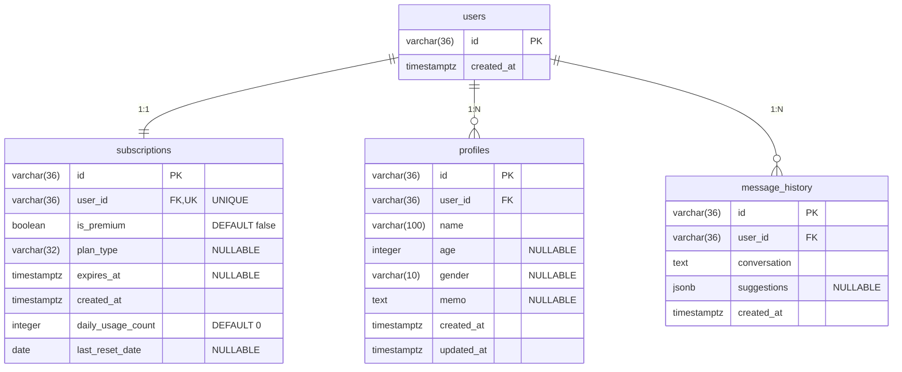

# Database Schema

Syrano 백엔드의 PostgreSQL 데이터베이스 스키마 정의

**생성 일자:** 2025-12-27  
**DBMS:** PostgreSQL 16  
**ORM:** SQLAlchemy 2.0 (Async)

---

## 📊 테이블 목록

1. [users](#users) - 사용자
2. [subscriptions](#subscriptions) - 구독 정보 (User 1:1)
3. [profiles](#profiles) - 채팅 상대 프로필 (User 1:N)
4. [message_history](#message_history) - 메시지 히스토리 (준비됨, 미사용)

---

## 🔗 ERD (Entity Relationship Diagram)


---

## 🗃️ 테이블 상세

### `users`

익명 사용자 정보
```sql
CREATE TABLE users (
    id VARCHAR(36) NOT NULL PRIMARY KEY,
    created_at TIMESTAMP WITH TIME ZONE NOT NULL
);
```

**컬럼 설명:**

| 컬럼 | 타입 | 제약 | 설명 |
|------|------|------|------|
| id | VARCHAR(36) | PK | UUID 문자열 |
| created_at | TIMESTAMPTZ | NOT NULL | 사용자 생성 시각 (UTC) |

**관계:**
- `1:1` → subscriptions
- `1:N` → profiles
- `1:N` → message_history

---

### `subscriptions`

사용자별 구독 정보 및 사용량 제한
```sql
CREATE TABLE subscriptions (
    id VARCHAR(36) NOT NULL PRIMARY KEY,
    user_id VARCHAR(36) NOT NULL UNIQUE,
    is_premium BOOLEAN NOT NULL DEFAULT FALSE,
    plan_type VARCHAR(32),
    expires_at TIMESTAMP WITH TIME ZONE,
    created_at TIMESTAMP WITH TIME ZONE NOT NULL,
    daily_usage_count INTEGER NOT NULL DEFAULT 0,
    last_reset_date DATE,
    
    FOREIGN KEY(user_id) REFERENCES users(id) ON DELETE CASCADE
);

CREATE UNIQUE INDEX ix_subscriptions_user_id ON subscriptions(user_id);
```

**컬럼 설명:**

| 컬럼 | 타입 | 제약 | 설명 |
|------|------|------|------|
| id | VARCHAR(36) | PK | UUID 문자열 |
| user_id | VARCHAR(36) | FK, UNIQUE | users.id (1:1 관계) |
| is_premium | BOOLEAN | NOT NULL | 프리미엄 구독 여부 |
| plan_type | VARCHAR(32) | NULLABLE | 구독 플랜 (weekly, monthly) |
| expires_at | TIMESTAMPTZ | NULLABLE | 구독 만료 시각 |
| created_at | TIMESTAMPTZ | NOT NULL | 구독 생성 시각 |
| daily_usage_count | INTEGER | NOT NULL | 오늘 사용 횟수 (무료: 5회 제한) |
| last_reset_date | DATE | NULLABLE | 마지막 카운터 리셋 날짜 |

**인덱스:**
- `ix_subscriptions_user_id` (UNIQUE)

**비즈니스 로직:**
- 무료 사용자: `daily_usage_count` ≤ 5
- 프리미엄 사용자: 무제한
- 자정마다 `daily_usage_count` 리셋

---

### `profiles`

채팅 상대방 프로필 정보 (User 1:N)
```sql
CREATE TABLE profiles (
    id VARCHAR(36) NOT NULL PRIMARY KEY,
    user_id VARCHAR(36) NOT NULL,
    name VARCHAR(100) NOT NULL,
    age INTEGER,
    gender VARCHAR(10),
    memo TEXT,
    created_at TIMESTAMP WITH TIME ZONE DEFAULT now() NOT NULL,
    updated_at TIMESTAMP WITH TIME ZONE DEFAULT now() NOT NULL,
    
    FOREIGN KEY(user_id) REFERENCES users(id) ON DELETE CASCADE
);

CREATE INDEX idx_profiles_user_id ON profiles(user_id);
```

**컬럼 설명:**

| 컬럼 | 타입 | 제약 | 설명 |
|------|------|------|------|
| id | VARCHAR(36) | PK | UUID 문자열 |
| user_id | VARCHAR(36) | FK | users.id |
| name | VARCHAR(100) | NOT NULL | 상대방 이름 (필수) |
| age | INTEGER | NULLABLE | 나이 |
| gender | VARCHAR(10) | NULLABLE | 성별 |
| memo | TEXT | NULLABLE | 메모 (특징, MBTI 등) |
| created_at | TIMESTAMPTZ | NOT NULL | 프로필 생성 시각 |
| updated_at | TIMESTAMPTZ | NOT NULL | 프로필 수정 시각 |

**인덱스:**
- `idx_profiles_user_id`

**사용:**
- LLM 프롬프트 개인화
- 상대방 특성 고려한 답장 생성

---

### `message_history`

메시지 생성 히스토리 (테이블 준비됨, 현재 미사용)
```sql
CREATE TABLE message_history (
    id VARCHAR(36) NOT NULL PRIMARY KEY,
    user_id VARCHAR(36) NOT NULL,
    conversation TEXT NOT NULL,
    suggestions JSONB,
    created_at TIMESTAMP WITH TIME ZONE NOT NULL,
    
    FOREIGN KEY(user_id) REFERENCES users(id) ON DELETE CASCADE
);

CREATE INDEX ix_message_history_user_id ON message_history(user_id);
```

**컬럼 설명:**

| 컬럼 | 타입 | 제약 | 설명 |
|------|------|------|------|
| id | VARCHAR(36) | PK | UUID 문자열 |
| user_id | VARCHAR(36) | FK | users.id |
| conversation | TEXT | NOT NULL | 입력된 대화 내용 |
| suggestions | JSONB | NULLABLE | 생성된 답장 목록 |
| created_at | TIMESTAMPTZ | NOT NULL | 생성 시각 |

**인덱스:**
- `ix_message_history_user_id`

**상태:**
- ⏸️ **현재 미사용** (MVP에서 제외)
- 향후 사용 패턴 분석, 통계, 학습에 활용 가능

---

## 📝 마이그레이션 히스토리

### v1.0 (2025-12-27)
**초기 스키마 생성**
- `users`, `subscriptions`, `message_history` 테이블 생성
- 익명 인증 기반 구조

### v1.1 (2025-12-27)
**Profile 기능 추가**
- `profiles` 테이블 생성
- User 1:N Profile 관계
- LLM 프롬프트 개인화

### v1.2 (2025-12-27)
**사용량 제한 기능 추가**
- `subscriptions` 테이블에 컬럼 추가:
  - `daily_usage_count` (INTEGER, NOT NULL, DEFAULT 0)
  - `last_reset_date` (DATE, NULLABLE)
- 무료/유료 사용량 제한 구현

---

## 🛠️ 로컬 개발 환경

### PostgreSQL 실행 (Docker)
```bash
# 컨테이너 시작
docker start syrano-postgres

# 컨테이너 접속
docker exec -it syrano-postgres psql -U syrano -d syrano

# 테이블 확인
\dt

# 스키마 확인
\d subscriptions
```

### 테이블 재생성 (개발용)
```bash
# ⚠️ 모든 데이터 삭제됨
docker stop syrano-postgres
docker rm syrano-postgres
docker volume rm syrano_pgdata

# 재생성
docker run --name syrano-postgres \
  -e POSTGRES_USER=syrano \
  -e POSTGRES_PASSWORD=syrano \
  -e POSTGRES_DB=syrano \
  -p 5432:5432 \
  -v syrano_pgdata:/var/lib/postgresql/data \
  -d postgres:16

# 서버 시작 시 자동 생성
pdm run dev
```

---

## 📊 인덱스 전략

| 테이블 | 인덱스 | 타입 | 목적 |
|--------|--------|------|------|
| subscriptions | user_id | UNIQUE | 1:1 관계 강제 + 빠른 조회 |
| profiles | user_id | INDEX | 사용자별 프로필 목록 조회 |
| message_history | user_id | INDEX | 사용자별 히스토리 조회 |

---

## 🔒 제약 조건

### Foreign Key Cascade

모든 FK는 `ON DELETE CASCADE` 설정:
- User 삭제 시 → 관련 Subscription, Profile, MessageHistory 자동 삭제
- 데이터 일관성 보장

### Unique Constraints

- `subscriptions.user_id`: User당 1개 구독만 허용

---

## 📈 향후 계획

- [ ] `message_history` 활용 (사용 패턴 분석)
- [ ] 파티셔닝 (대용량 히스토리 대비)
- [ ] 읽기 전용 레플리카 (조회 성능 개선)
- [ ] 인덱스 최적화 (실사용 쿼리 패턴 기반)